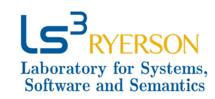

# MSMarco Chameleons: Challenging the MSMarco Leaderboard with Extremely Obstinate Queries

In this work we find that while rankers have witnessed an impresive improvement in the oeprformance during the recent years, there are still a significant number of queries that
cannot be addressed by any of the state of the art neural rankers. We refer to these queries as obstinate queries because of their difficulty.
This means that regardless of the neural ranker, these queries will not see any performance improvements and the increase in overall
performance reported by the ranker are due to improvements on another selected subset of queries. We believe that careful treatment on these queries will lead 
to the a more stable and consistent performance of neural rankers across all the queries.

We investigate the performance of SOTA rankers  on MSMARCO small dev set  which contains 6980 queries. We noticed no matter
which baseline method is considered, whether it be a traditional BM25 ranker or a complex neural ranker, there is a noticeable number
of queries for which the rankers are unable to return any reasonable ranking. Further there is a noticeable number of poorly performed queries that are in common acroos all the rankers. Table 1 illustrates the performance of  the 'difficult' queries qhich are among least 50% performance of each baseline and are in common in 4,5 and 6 of SOTA rankers  

**Table 1. : MAP Performance of  the rankers on 50% hardest queries of the Chameleon datasets.**
| Variations          | Dataset Name           | Number of Queries            |BM25   | DeepCT | DocT5Query | RepBert | ANCE   | TCT-Colbert |
|---------------------|------------------------|------------|-------|--------|------------|---------|--------|-------------|
| Common in   **6** rankers | [Lesser   Chameleon](https://github.com/Narabzad/Chameleons/tree/master/datasets/Lesser(common6))   |1693   |0.0066  [(Run)](https://drive.google.com/file/d/1TfRPhLhP2KxTVqERRUQ7_WJz3Gxa1HaW/view?usp=sharing) | 0.0122  [(Run)](https://drive.google.com/file/d/1iRiLPUn-q6e533mAOKakKavTVv7dH5nI/view?usp=sharing) | 0.0185  [(Run)](https://drive.google.com/file/d/14OyXbW2_TY0EnoCdKynRS6FaY8mqHUBm/view?usp=sharing)    | 0.0212  [(Run)](https://drive.google.com/file/d/1k-z09WlRVDG8INkkwydPGL16Yq5RfUDE/view?usp=sharing)  | 0.0286  [(Run)](https://drive.google.com/file/d/19UjCOSMSE7xpLKT2sQX0IggzIOA-6uEV/view?usp=sharing) | 0.0267  [(Run)](https://drive.google.com/file/d/1vTFyJ4LlhE-GnGXmC_d1t4yxKr7rt7Vt/view?usp=sharing)     |
| Common in   **5** rankers | [Pygmy   Chameleon](https://github.com/Narabzad/Chameleons/tree/master/datasets/Pygmy(common5))|2473   |0.0215  [(Run)](https://drive.google.com/file/d/1rj_MNACTIHUWl87dCRWkmPgwx1h2Rhq5/view?usp=sharing) | 0.0240  [(Run)](https://drive.google.com/file/d/1b7LID4TSHIiBj-sK2kZRxE-y_TLpsB4h/view?usp=sharing) | 0.0403  [(Run)](https://drive.google.com/file/d/1xx30IQWME8TkTrVbMeO8st9cXFL2fofl/view?usp=sharing)    | 0.0398  [(Run)](https://drive.google.com/file/d/1pNxulAWG2fGbZ2bEFWwnqSnwuMXZtHHW/view?usp=sharing)  | 0.0546  [(Run)](https://drive.google.com/file/d/15KON9hz2dFgd1pYy8nTtqAsWYSPBsBf7/view?usp=sharing) | 0.0462  [(Run)](https://drive.google.com/file/d/1Wapdz0h2noJCRlPSIw2X425krl7wTlOq/view?usp=sharing)     |
| Common in   **4** rankers | [Veiled   Chameleon](https://github.com/Narabzad/Chameleons/tree/master/datasets/Veiled(common4))|3119  |0.0392  [(Run)](https://drive.google.com/file/d/1manHBekmogC1gcpgQ2hrksjZNqXwV5PK/view?usp=sharing)| 0.0400  [(Run)](https://drive.google.com/file/d/1GNsjimgEaF15FSKVv19xVVBG-Nbmkp1d/view?usp=sharing)| 0.0660  [(Run)](https://drive.google.com/file/d/1FCFvWYFngrK6s9zXQ-hI8a0zBAuAT0Vn/view?usp=sharing)    | 0.0560  [(Run)](https://drive.google.com/file/d/1MORyZyZYME9ZREvAEcGBjyeoDlqjcIc7/view?usp=sharing) | 0.0847  [(Run)](https://drive.google.com/file/d/1Ag-gh3ti9MLpasLI8iwngsns7y6IxMf-/view?usp=sharing) | 0.0780   [(Run)](https://drive.google.com/file/d/1-_KDsTRtrJAfw34UlJpxBNTJjPtXDsYJ/view?usp=sharing)    |

We made all the runs available in the [Chameleons Google drive](https://drive.google.com/drive/folders/1vj8YC6YcADiiS7DjqepDMC9F_uaRneJC?usp=sharing). 

## Baseline rankers implementation
You can find the [details of implementation of each method here](https://github.com/Narabzad/Chameleons/blob/master/Baselines%20documentations.md). 

## Query Reformulation
Furthermore, given the literature has reported that hard queries can often be due to issues such as vocabulary mismatch, and
hence can be improved through query reformulation, we report the performance of several strong query reformulation 
techniques on the MSMarco Chameleons dataset and show that such queries remain stubborn and do not report noticeable performance
improvements even after systematic reformulation.

The expanded queries can be found [here](https://github.com/Narabzad/Chameleons/tree/master/expanded%20Queries) which are implemented using [ReQue toolkit](https://github.com/hosseinfani/ReQue). 

<table class="tg">
<thead>
  <tr>
    <th class="tg-0pky"></th>
    <th class="tg-0pky"></th>
    <th class="tg-c3ow" colspan="6">Map pn the 50% Outstalet's dataset</th>
  </tr>
</thead>
<tbody>
  <tr>
    <td class="tg-0pky">Category</td>
    <td class="tg-0pky">query</td>
    <td class="tg-0pky">BM25</td>
    <td class="tg-0pky">DeepCT</td>
    <td class="tg-0pky">DocT5</td>
    <td class="tg-0pky">RepBert</td>
    <td class="tg-0pky">ANCE</td>
    <td class="tg-0pky">TCT-ColBert</td>
  </tr>
    <tr>
    <td class="tg-0pky" rowspan="5">  Psuedo-Relevance Feedback </td>
  </tr>

  <tr>
    <td class="tg-0pky">Relevance feedback</td>
    <td class="tg-4yk9"> 0.0477 <a href="https://github.com/Narabzad/Chameleons/blob/master/expanded%20Queries/Relevance%20Feedback/outstalet_50_relevancefeedback.bm25.topn10"" target="_top"> (query) </a></td>
    <td class="tg-4yk9"> 0.0574 <a href="https://github.com/Narabzad/Chameleons/blob/master/expanded%20Queries/Relevance%20Feedback/outstalet_50_relevancefeedback.deepct.topn10"" target="_top"> (query) </a></td>
    <td class="tg-4yk9"> 0.0566 <a href="https://github.com/Narabzad/Chameleons/blob/master/expanded%20Queries/Relevance%20Feedback/outstalet_50_relevancefeedback.DocT5.topn10"" target="_top"> (query) </a></td>
    <td class="tg-4yk9"> 0.0513 <a href="https://github.com/Narabzad/Chameleons/blob/master/expanded%20Queries/Relevance%20Feedback/outstalet_50_relevancefeedback.repbert.topn10"" target="_top"> (query) </a></td>
    <td class="tg-4yk9"> 0.0277 <a href="https://github.com/Narabzad/Chameleons/blob/master/expanded%20Queries/Relevance%20Feedback/outstalet_50_relevancefeedback.ance.topn10"" target="_top"> (query) </a></td>
    <td class="tg-4yk9"> 0.0693 <a href="https://github.com/Narabzad/Chameleons/blob/master/expanded%20Queries/Relevance%20Feedback/outstalet_50_relevancefeedback.colbert.topn10"" target="_top"> (query) </a></td>
  </tr>
  <tr>
    <td class="tg-0pky">RM3</td>
    <td class="tg-0pky"> 0.0407 <a href="https://github.com/Narabzad/Chameleons/blob/master/expanded%20Queries/RM3/outstalet_50_rm3.bm25"" target="_top"> (query) </a></td>
    <td class="tg-0pky"> 0.0375 <a href="https://github.com/Narabzad/Chameleons/blob/master/expanded%20Queries/RM3/outstalet_50_rm3.deepct"" target="_top"> (query) </a></td>
    <td class="tg-0pky"> 0.0603 <a href="https://github.com/Narabzad/Chameleons/blob/master/expanded%20Queries/RM3/outstalet_50_rm3.doct5"" target="_top"> (query) </a></td>
    <td class="tg-0pky"> 0.0459 <a href="https://github.com/Narabzad/Chameleons/blob/master/expanded%20Queries/RM3/outstalet_50_rm3.repbert"" target="_top"> (query) </a></td>
    <td class="tg-0pky"> 0.0374 <a href="https://github.com/Narabzad/Chameleons/blob/master/expanded%20Queries/RM3/outstalet_50_rm3.ance"" target="_top"> (query) </a></td>
    <td class="tg-0pky"> 0.0610 <a href="https://github.com/Narabzad/Chameleons/blob/master/expanded%20Queries/RM3/outstalet_50_rm3.colbert"" target="_top"> (query) </a></td>
  </tr>
  <tr>
    <td class="tg-0pky">Document clustering</td>
    <td class="tg-4yk9"> 0.0392 <a href="https://github.com/Narabzad/Chameleons/blob/master/expanded%20Queries/Document%20Clustering/outstalet_50_docluster.bm25.topn10.3"" target="_top"> (query) </a> </td>
    <td class="tg-4yk9"> 0.0393 <a href="https://github.com/Narabzad/Chameleons/blob/master/expanded%20Queries/Document%20Clustering/outstalet_50_docluster.deepct.topn10.3"" target="_top"> (query) </a></td>
    <td class="tg-4yk9"> 0.0593 <a href="https://github.com/Narabzad/Chameleons/blob/master/expanded%20Queries/Document%20Clustering/outstalet_50_docluster.DocT5.topn10.3"" target="_top"> (query) </a></td>
    <td class="tg-4yk9"> 0.0550 <a href="https://github.com/Narabzad/Chameleons/blob/master/expanded%20Queries/Document%20Clustering/outstalet_50_docluster.repbert.topn10.3"" target="_top"> (query) </a></td>
    <td class="tg-4yk9"> 0.0609 <a href="https://github.com/Narabzad/Chameleons/blob/master/expanded%20Queries/Document%20Clustering/outstalet_50_docluster.ance.topn10.3"" target="_top"> (query) </a></td>
    <td class="tg-4yk9"> 0.0765 <a href="https://github.com/Narabzad/Chameleons/blob/master/expanded%20Queries/Document%20Clustering/outstalet_50_docluster.colbert.topn10.3"" target="_top"> (query) </a></td>
  </tr>
  <tr>
    <td class="tg-0pky">Term Clustering </td>
    <td class="tg-0pky"> 0.0412 <a href="https://github.com/Narabzad/Chameleons/blob/master/expanded%20Queries/Term%20Clustering/outstalet_50_termluster.bm25.topn5.3"" target="_top"> (query) </a></td>
    <td class="tg-0pky"> 0.0424 <a href="https://github.com/Narabzad/Chameleons/blob/master/expanded%20Queries/Term%20Clustering/outstalet_50_termluster.deepct.topn5.3"" target="_top"> (query) </a></td>
    <td class="tg-0pky"> 0.0567 <a href="https://github.com/Narabzad/Chameleons/blob/master/expanded%20Queries/Term%20Clustering/outstalet_50_termluster.DocT5.topn5.3"" target="_top"> (query) </a></td>
    <td class="tg-0pky"> 0.0557 <a href="https://github.com/Narabzad/Chameleons/blob/master/expanded%20Queries/Term%20Clustering/outstalet_50_termluster.repbert.topn5.3"" target="_top"> (query) </a></td>
    <td class="tg-0pky"> 0.0693 <a href="https://github.com/Narabzad/Chameleons/blob/master/expanded%20Queries/Term%20Clustering/outstalet_50_termluster.ance.topn5.3"" target="_top"> (query) </a></td>
    <td class="tg-0pky"> 0.0724 <a href="https://github.com/Narabzad/Chameleons/blob/master/expanded%20Queries/Term%20Clustering/outstalet_50_termluster.colbert.topn5.3"" target="_top"> (query) </a></td>
  </tr>
  <tr>
 <tr>
    <td class="tg-0pky" rowspan="8">   External Sources </td>
  </tr>
 <tr>

   <td class="tg-0pky"> Neural Embeddings <a href="https://github.com/Narabzad/Chameleons/blob/master/expanded%20Queries/Neural%20Embeddings/outstalet_50_word2vec.topn3"" target="_top"> (query) </a>  </td>
    <td class="tg-4yk9"> 0.0218 </td>
    <td class="tg-4yk9"> 0.0248 </td>
    <td class="tg-4yk9"> 0.0285 </td>
    <td class="tg-4yk9"> 0.0409 </td>
    <td class="tg-4yk9"> 0.0468 </td>
    <td class="tg-4yk9"> 0.0462 </td>
  </tr>
   <tr>
    <td class="tg-0pky"> WikiPedia <a href="https://github.com/Narabzad/Chameleons/blob/master/expanded%20Queries/Wikipedia/outstalet_50_wiki.topn3"" target="_top"> (query) </a>
 </td>
    <td class="tg-4yk9"> 0.0277 </td>
    <td class="tg-4yk9"> 0.0313 </td>
    <td class="tg-4yk9"> 0.0341 </td>
    <td class="tg-4yk9"> 0.0368 </td>
    <td class="tg-4yk9"> 0.0466 </td>
    <td class="tg-4yk9"> 0.0396 </td>
  </tr>
   <tr>
    <td class="tg-0pky"> Thesaurus<a href="https://github.com/Narabzad/Chameleons/blob/master/expanded%20Queries/Thesaurus/outstalet_50_thesaurus.topn3"" target="_top"> (query) </a></td>
    <td class="tg-4yk9"> 0.0277</td>
    <td class="tg-4yk9"> 0.0313</td>
    <td class="tg-4yk9"> 0.0341 </td>
    <td class="tg-4yk9"> 0.0368 </td>
    <td class="tg-4yk9"> 0.0466 </td>
    <td class="tg-4yk9"> 0.0396</td>
  </tr>
  <tr>
      
   <td class="tg-0pky"> Entity Linking <a href="https://github.com/Narabzad/Chameleons/blob/master/expanded%20Queries/Entity%20Linking/outstalet_50_tagmee.topn3"" target="_top">(query)</a>
    </td>
    <td class="tg-4yk9"> 0.0399 </td>
    <td class="tg-4yk9"> 0.0450 </td>
    <td class="tg-4yk9"> 0.0543 </td>
    <td class="tg-4yk9"> 0.0507 </td>
    <td class="tg-4yk9"> 0.0533</td>
    <td class="tg-4yk9"> 0.0649</td>
  </tr>
  <tr>
    <td class="tg-0pky">Sense Disambigution <a href="https://github.com/Narabzad/Chameleons/blob/master/expanded%20Queries/Sense%20Disambigution/outstalet_50_sensedisambiguation"" target="_top">(query)</a>
  </td>
    <td class="tg-0pky"> 0.0359</td>
    <td class="tg-0pky"> 0.0360</td>
    <td class="tg-0pky"> 0.0521</td>
    <td class="tg-0pky"> 0.0512</td>
    <td class="tg-0pky"> 0.0653</td>
    <td class="tg-0pky"> 0.0633</td>
  </tr>
  <tr>
    <td class="tg-0pky">ConceptNet  <a href="https://github.com/Narabzad/Chameleons/blob/master/expanded%20Queries/ConceptNet/outstalet_50_conceptnet.topn3"" target="_top">(query)</a>
     </td>
    <td class="tg-4yk9"> 0..0269</td>
    <td class="tg-4yk9"> 0.0278</td>
    <td class="tg-4yk9"> 0.0342</td>
    <td class="tg-4yk9"> 0.0369</td>
    <td class="tg-4yk9"> 0.0488</td>
    <td class="tg-4yk9"> 0.0442</td>
  </tr>
  <tr>
    <td class="tg-0pky"> WordNet  <a href="https://github.com/Narabzad/Chameleons/blob/master/expanded%20Queries/WordNet/outstalet_50_wordnet.topn3"" target="_top">(query)</a>
      </td>
    <td class="tg-0pky"> 0.0271</td>
    <td class="tg-0pky"> 0.0569</td>
    <td class="tg-0pky"> 0.0346</td>
    <td class="tg-0pky"> 0.0359</td>
    <td class="tg-0pky"> 0.0399</td>
    <td class="tg-0pky"> 0.0406</td>
  </tr>
  <tr>
 <tr>
    <td class="tg-0pky" rowspan="5">   Supervised Approaches </td>
  </tr>

  <tr>
    <td class="tg-0pky"> ANMT (Seq2Seq) <a href="https://github.com/Narabzad/Chameleons/blob/master/expanded%20Queries/supervised%20methods/outstalet_50_predicted_queries_deep_seq2seq.tsv"" target="_top">(query)</a>  </td>
    <td class="tg-4yk9"> 0.0002 </td>
    <td class="tg-4yk9"> 0.0007</td>
    <td class="tg-4yk9"> 0.0010</td>
    <td class="tg-4yk9"> 0.0020</td>
    <td class="tg-4yk9"> 0.0046</td>
    <td class="tg-4yk9"> 0.0066</td>
  </tr>
  <tr>
  
   <td class="tg-0pky">ACG (Seq2Seq + Attention)   <a href="https://github.com/Narabzad/Chameleons/blob/master/expanded%20Queries/supervised%20methods/outstalet_50_predicted_queries_deep_acg.tsv"" target="_top">(query)</a> </td>
    <td class="tg-0pky"> 0.0240</td>
    <td class="tg-0pky"> 0.0307</td>
    <td class="tg-0pky"> 0.0359</td>
    <td class="tg-0pky"> 0.0433</td>
    <td class="tg-0pky"> 0.0450</td>
    <td class="tg-0pky"> 0.0470</td>
  </tr>
  <tr>
  
   <td class="tg-0pky"> HRED-qs  <a href="https://github.com/Narabzad/Chameleons/blob/master/expanded%20Queries/supervised%20methods/outstalet_50_predicted_queries_deep_hredqs.tsv"" target="_top">(query)</a></td>
    <td class="tg-4yk9"> 0.006</td>
    <td class="tg-4yk9"> 0.002</td>
    <td class="tg-4yk9"> 0.003</td>
    <td class="tg-4yk9"> 0.0060</td>
    <td class="tg-4yk9"> 0.0082</td>
    <td class="tg-4yk9"> 0.0110</td>
  </tr>
</tbody>
</table>

It should be noted that the psuedo-relevance feedback-based query expansion methods are different for each run since they are based on initial first round of retrieval. However, for other methods, the expansion queries are the same. 

## Authors
[Negar Arabzadeh](https://github.com/Narabzad) and [Ebrahim Bagheri](https://www.ee.ryerson.ca/~bagheri/)

Laboratory for Systems, Software and Semantics ([LS3](http://ls3.rnet.ryerson.ca/)), Ryerson University, ON, Canada.

    

